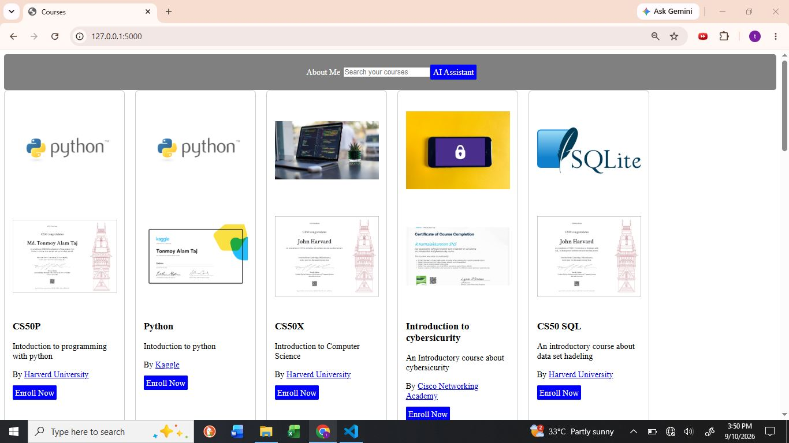
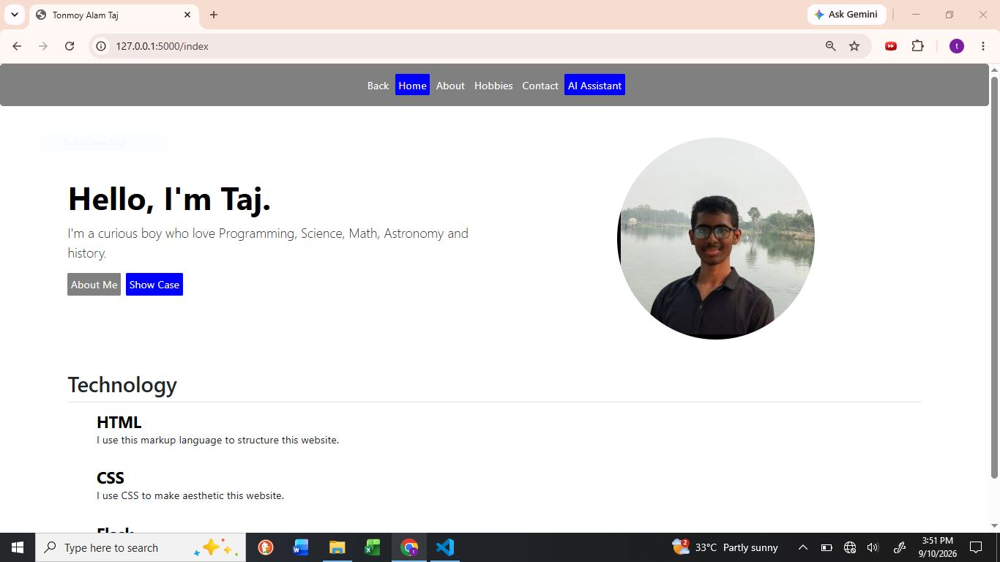
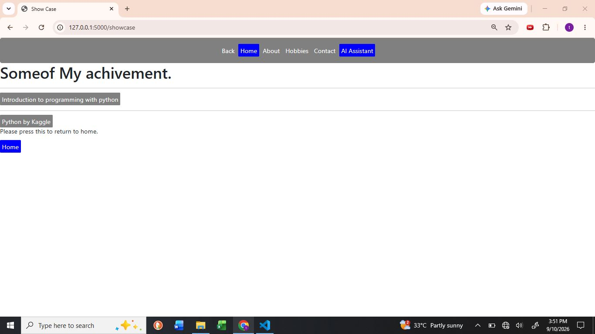
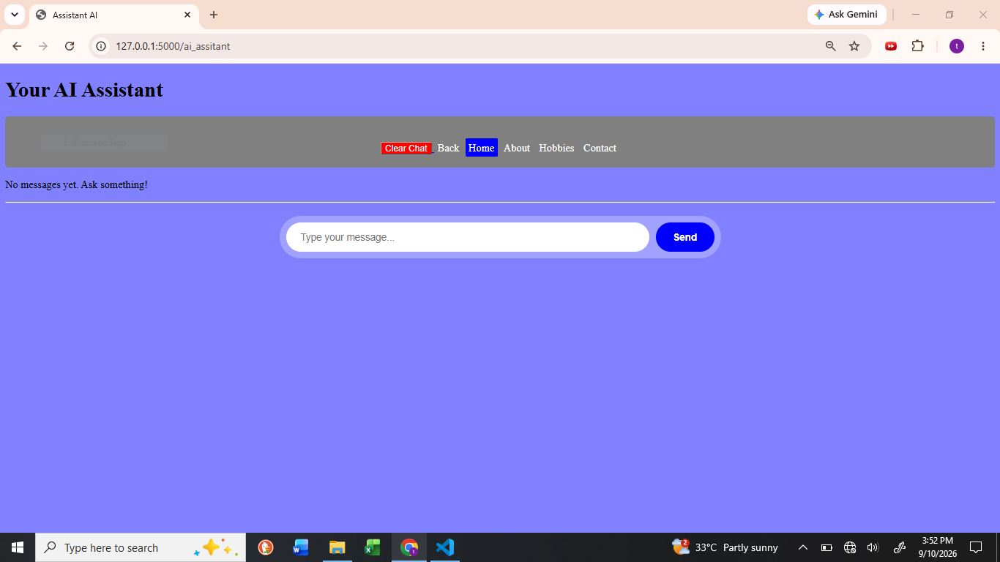

# LEARN2GAIN TAT
#### Video Demo:  <https://www.youtube.com/watch?v=gT7g1iAgad4>
#### Usable Version: <https://learn2gain.onrender.com>
#### Description:
Learn2Gain is a centralized web platform designed to help learners easily discover top-tier, free certificate courses from renowned platforms like CS50, Kaggle, Cisco etc. The web app features an interactive display of courses, direct enrollment links, an embedded portfolio, and an integrated AI Assistant (powered by Groq) to guide users through the platform.

#### Project Purpose:
The main objective of Learn2Gain is to simplify the continuous learning journey by solving the issue of course fragmentation. By consolidating high-quality free learning resources with verifiable certificates in one place, it helps students and self-learners identify the right courses based on organization, reviews, and certificate details—all supported by an intelligent AI assistant.

## User Manual:
At first You can see a page where many courses are shown in a different box. Each of the box you can find course name,a photo related to that couse, and the second photo was that free certificate that provide that organization if you complete their project. Additionally you can find a short description about that couse, which organization/univesity/company provide that couse and lastly you can find a blue color enroll button.

<photo>
Here you can find many couse like cs50p, python,cs50x etc that is called <u>course name</u>.

Now firstly you can see a Thumbali like: first two photo show us python logo and third one is a computer on the desk that is not much important.

Thidly you can see a certificate this certificate will provide who complete their courses. If you click there you will find enrollment link.

Now fourthly you can see a short description like in first box you can see :" Introduction to programming with python", in second box: "Intoduction to python".

Fifthly you can see the organizatio/university/company name which provide that free course with certificate.

Finally you can see a Enroll Now button by cliking there you will find official enrollment page of that course.

In the top of the page you can see 3 option firstly (About Me), secondly a search box and thirdly Ai Assistant button.

If You click About Me button you will find a page where my protfolio will be shown.

Now You can see in the top there have many options like (Back,Home,About,Hobbies,Contact,AI assistant)

In the page you can see about me button and show case button.

If you click show case button you will find some of my certificate like introduction to programming with python,Python by Kaggle etc. 

If you click that button you will find my offical certificate with credentials.

If you click home you will return to the main protfolio page (Home).

Now if you click (About) you will find some of my personal information. 

If you click Hobbies button you know about some of my hobbies 

Additionally If you click the contact button you will find my linkdin and github account.

Lastly you can find a button called (AI Assistant) 

if you click there you will find a new blue color page. In the middle of that page you can find a ber where you can find (clear chat,Back,Home,About,Hobbies,Contact) at the same time you will find a text box where you can type many question and the by pressing send button you can send the message to groq AI. I use API keys and cusotomized some feature in that AI. You can eassly ask you question related to my web-application. If you stuck any where you can use it and get the answere.

If you click (clear chat) button the chat you made with AI will be removed.

If you press (Back) button you will return to the couse option page.

#### Techonology:
##### Backend:
Python

Python OS library

FLask

Groq API

CSV
##### Fontend:
HTML

CSS

JavaScript
##### Core Feature:
Dynamic Course Showcase

Integrated Search

Groq AI Assistant

Portfolio Page
